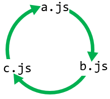

# What is ECMAScript?
Note:
This session will go over ESM and it's impact on our code base

Going to introduce the basics of ECMAScript, transpilers and bundlers
---
Standardises Javascript 
Note: interoperabliliy across runtimes

browsers, firefox, chrome

nodejs

We want code to run the same across all runtimes

---
It defines the syntax for classes, arrow functions, and modules.

```javascript
//String.prototype.trim()
const greeting = '   Hello world!   ';

console.log(greeting);
// Expected output: "   Hello world!   ";

console.log(greeting.trim());
// Expected output: "Hello world!";

```

Note:
It defines how things work across runtimes

Its up to each runtime how it's implemented

But it behaves the same

---
[ECMAScript Compatibility](https://compat-table.github.io/compat-table/es2016plus/)
-----

# ESM
or ECMAScript Module is the format for importing and exporting in javascript


Note:
We're here today talk about what it is an ecmascript module

How does it impact us?
---
## ESM
```javascript
// math.js
export function add(a, b) {
  return a + b;
}

// main.js
import { add } from './math.js';

console.log(add(1, 2));
```

Note:

You should all be familiar with the syntax

It lays out how code is imported/export

----- 
## What came before ESM?


Note:

We only write ESM here

---
## CommonJS

```javascript
// math.js
function add(a, b) {
  return a + b;
}

module.exports = add;

// main.js
const add = require('./math.js');

console.log(add(1, 2));
```
Note:

A different way of importing and exporting code

Default export of add and importing it 


-----
## Why is the industry moving to ESM?

Note:

Common js looked similar and it looked like it worked?

---
## Asynchronous Loading
- Doesn't block the main thread
- Supports Lazy loading
Note: 
*** COMMONJS *** USES SYNCHRONOUS LOADING
It doesn't block the main thread when loading modules. 

Allows the browser to continue loading the page.

It also supports lazy loading of modules.

This allows a faster startup time for your application.

smaller memory footprint.

reduced download size.

better for mobile devices/slow internet.

people abandon sites that take longer than 3 seconds to load.


---
### Static Analysis of import/exports
- Better tree shaking
- Better bundling
Note: 

Tighter syntax of import/export statements

This means the bundling process is more efficient

Smaller bundle sizes means a faster load time for your application

---
## How does ESM do this??
---
1. Tighter syntax around how you import/export code from a module
  - Exports must be top level
  - Exports cannot be generated dynamically
  
Note: 

Because the import/export statements are static

can't be nested inside functions

Dynamic imports are bad if you want to figure out what code is being imported/used

It's also not great if you want know what's happening at runtime as a loop could generate a dynamic exports inside the module

---
2. Cyclic Dependencies handling is more robust than commonJS



Note:
When commonjs loops through it modules it leaves undefined variables behind. 

Potentially leading to unexpected behaviour

ESM creates placeholders as it iterates through the cyclical dependencies so it can keep track of changes
---
3. ESM imports are resolved and evaluated statically during the module's parsing phase. 

Note:
This means that attempts to modify or rewire imports at runtime, as commonly done in CommonJS, won't work directly with ESM

-----
Wait you still haven't explained why this is a problem?

Note:

Isn't this why we're all here?

---
## The problem
You can't rewire modules at runtime!!!

Note:

Didn't I say this was bad?

and we're doing it? What?

---
Unit Tests

```javascript
import * as fsModule from 'fs'

//Doesn't work anymore 💩
sinon.stub(fsModule, 'readFileSync').returns('hello 💩💩💩')
```

Note:

We use module rewiring to mock out dependencies

This is critical because this is how we test our code

---
Why is this a problem now?

Note:

Don't we already write esm?

Because we transpile down to commonjs code.

Which means Mocha is running in commonjs.

Its able to do that dynamic rewiring on the fly

---
## What are Transpilers

Are tools that convert JS(ESM) to different versions of JS(CommonJS)

Note:

Why might we do this?

New language features not supported by runtimes

For example older browser may not support new language features like trim

Trim could be replaced by a function that does the same thing but does it in a way that older browsers can understand 

like using regex to find whitespace at the start and end of a string and removing it

We want to use a different module system for compatibility

I've been able to use ESM fully in fleet api without issue

--- 
Transpilers
- ts-node
- tsc (typescript)

--- 
```json
{
    "target": "ES2023",
    "module": "commonjs", //ES2023
}
```

Note:
Modified through the ts config

Target: What the code will be compiled down to e.g. trim

Module: The module system we want to use e.g. import/export

---
What's the scope of impact?

Note:
All our NodeJS tests

Maybe some front end stuff but probably not

-----
### Why do we want to change?

- CommonJS is being phased out
- Newer transpilers don't support commonJS
- Frameworks are moving to ESM
- Can't use all the features of ESM
- ESM is the future

Note:
We can't use all the ESM features transpiling down to commonJS

can't use top level awaits

Bundlers aren't as efficient webpack tries its best

We're going to slowly become version locked

Angulars new builder is ESM only

Chai our assertion library has moved to ESM

Lets not keep adding to tech debt


-----
# Solutions

---

## Dependency Injection

```javascript [1: 1-3| 5-10 | 5-11 | 1-100]
getUsers(client: HttpClient) {
  return client.get('/users')
}

//test

const mockClient = {
  get: sinon.stub().returns({data: []})
}

const users = getUsers(mockClient)

expect(users).to.deep.equal(expected)
```

Note:

C#/Angular

Its generally done to make testing easier

Provide a function or class with the dependencies

in the constructor the function parameters

---

## Rewiring Library
```javascript [1: 1-3| 5-10 | 1-100] 
  const axiosInstance = axios.create()
  moxios.install(axiosInstance)
  moxios.stubRequest('/liveUsage', {response: payload})

  //Module Being tested
  const module = await esmock('./moduleBeingTested.ts',
  //Functions you want to be mocked
  { 
    '../http.ts': { platformClient: () => axiosInstance }
  })
  const result = await module.getUbiUsage(locations)

  expect(result).to.deep.equal(expected)
```
Note:     
Module rewiring is similar to how we do things already

We call a wrapper for our module that replaces the references for us

//Path to the module you want to mock

//Name of the function you want to mock

//The function you want to replace it with

Not ideal because we're relying on a middle layer to run and test our code.

Which is added complexity

We need to think about if this is the right way forward or if we want to use DI

Lowest friction for change

----- 
### I've fixed the tests now what?

Note:
We need to do a little more work to be fully ESM compliant

---
Update your package.json to have it's module type as 
```json
{
  "type": "module"
}
```
---
Update your tsconfig.json to have it's module type as 
```json
{
  "module": "ES2023",
  "target": "ES2023"
}
```

-----
# Questions?

Note:

Next Steps:

We need to decide on a pathway forward

We need to decide on a migration plan

There is a partial step where we can write our tests to be esm compliant but still target commonjs